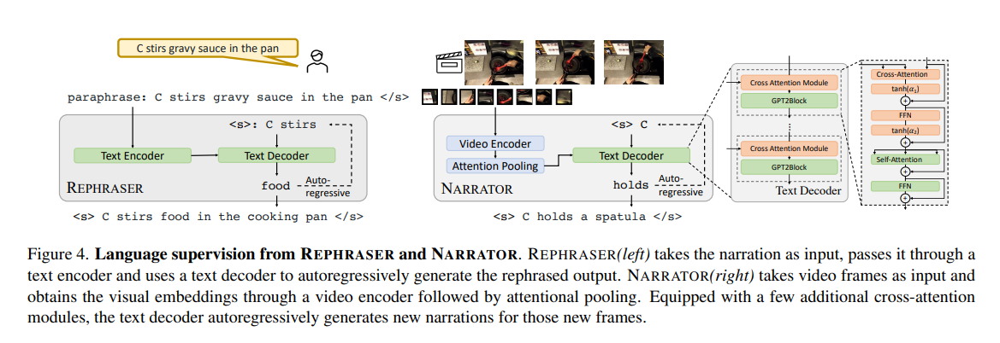
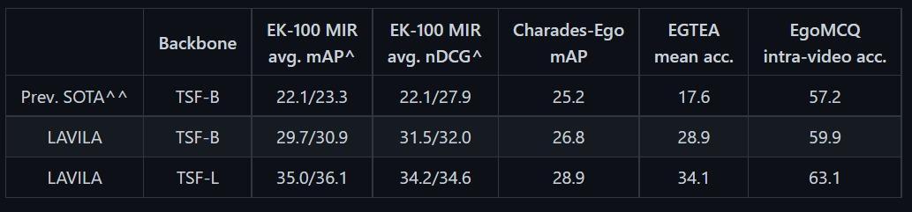
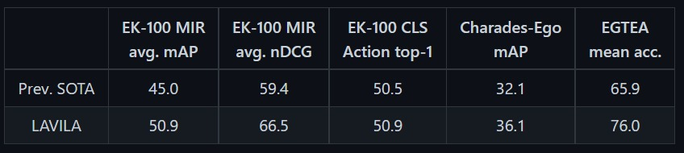

# Evaluating Data Attribution for Text-to-Image Models

Sheng-Yu Wang, Alexie A. Efros, Jun-Yan Zhu, Richard Zhang
**2023**
## Summary

The paper proposes a solution for the data attribution problem, i.e finding which images of the training dataset are most responsible for a given generated image. They create a customized dataset to train a standard feature encoder to rate the pairs of generated image with causational images. They hence provide a comparative metric to evaluate candidate image retreival feature spaces.

## Contributions

- Since the model uses captions generated by an LLM, we can train the Dual Encoder effectively even with a very small fraction of ground-truth dataset.
This is highly beneficial since the amount of readily available densely annotated video clips are very less.
- It provides a very strong alignment between the visual input and generated text.
- It can also expand annotations when they are provided very sparsely, or are not able to capture all details of activities occuring in the video frame.

## Method
  
- The method LaViLa uses 2 LLM's: a NARRATOR and a REPHRASER for pseudo-text generation. These are pretrained on english words, and are fine-tuned on visual embeddings.
  - The Narrator architecture uses a frozen pre-trained LLM, and adds cross-attention modules having text tokens and the visual embeddings as input.
  - The Rephraser paraphrases the output generated by Narrator by replacing synonyms or changing word order etc.    
    
- The pseudo-captions generated by the Narrator and Rephraser, alongwith the ground truth video-text pairs are then used to train the DUAL ENCODER. 
It uses contrastive losses such as CLIP, InfoNCE for the same.

## Results
LaViLa outperforms the previous state-of-the-art video-language pretraining methods on different datasets such as EK100 MIR, Charades-Ego, EGTEA etc.  
The evaluation is done through several protocols, and the approach outperforms the previous SOTA in all cases.
- In *Zero-Shot* protocol, the model is applied to a new set of downstream validation datasets.  
[ The two different numbers are obtained on using two different number of frames as input (4-frame and 16-frame respectively) ].
  
- In *Fine-Tuned* protocol, the model is end-to-end fine-tuned on the training split of the target downstream datasets.
  

## Two-Cents

- This can be improved by taking the 

## Resources
- Paper: https://arxiv.org/abs/2306.09345
- Implementation : https://github.com/peterwang512/GenDataAttribution
